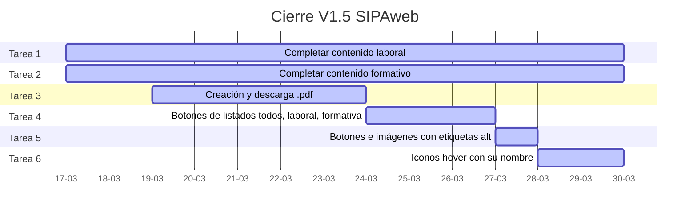

# Cronograma Estimado, fases de desarrollo por hitos, no por fechas rígidas

## Cronograma de Hitos

### HITO 1 FINALIZADO

Hito 1: Estructura de documentación y base del conector Python.

- Núcleo y Documentación

- Para alcanzar el hito 1, los pasos a seguir son estos
  - [x] Creación de estructura de desarrollo inicial
    - Ubicación desarrollo: /SIPA_PROJECT/constructor/sipaweb/
  - [x] Instalación Mkdocs
    - Instalado en sipaweb, creado /SIPA_PROJECT/constructor/sipaweb/docs/index.md
  - [x] Tests y pruebas
    - Pruebas al la herramienta de documentación
    - Pruebas al script
  - [x] Todo documentado y funcionando hito 1 conseguido

### HITO 2 EN PROCESO

Hito 2: Página de presentación profesional (Landing Page inicial).

- Generador y Despliegue

-Para alcanzar el hito 2, los pasos a seguir son estos

- [x] Crear docs/about-me.md
  - Crear directorio templates/
  - Crear templates/base.html
- [x] Crear funciones en sipaweb.py incluirlas en la clase
  - leer_markdown_nativo()
  - render_index()
  - generar_sitio()
- [x] Crear index.html
  - Test página html navegador
- [x] Planificar el despliegue
  - Crear ubicación correcta
  - Crear index real .md, about-me.md debe ser secundaria, se incluye la biografía mínima
  - Crear proyectos.md
  - Crear contacto.md
  - Crear ayuda.md
  - Test web completa, se ejecuta correctamente la actualización en local y todo es correcto
  - Añadir github actions, configurar correctamente, realizar pruebas necesarias
- [x] Revisión completa a modo auditoría
  - [x] README.md presente
  - [x] mkdocs.yml presente
  - [x] .gitignore presente
  - [x] requirements.txt presente
  - [x] /.github/workflows/deploy.yml presente
  - [x] acta_fundacion.md presente
  - [x] index.md presente
  - [x] referencia.md presente
  - [x] bitacora_sipaweb.md presente
  - [x] revisión arquitectura y árbol
  - [x] revisión lógica
  - [x] revisión objetivo
  - [x] revisión situación final

Hito 2 A : Confeccionar página a página

- [x] Diseño estructura, acciones, contenido de index.html
  - [x] Definir estructura
  - [x] Definir colores marca
  - [x] Definir iconos
  - [x] Definir bloques
  - [x] Definir contenido
- [x] Enlace de todas con todas, a través de una barra navegación fija
- [x] Enlace de los proyectos en el pie según perfil tovid o mimod
- [x] Diseño estructura, acciones, contenido de sobre-mi.html
- [x] Diseño estructura, acciones, contenido de proyectos.html
- [x] Diseño estructura, acciones, contenido de contacto.html
- [x] Diseño estructura, acciones, contenido de ayuda.html

CIERRE DE VERSIÓN Y LANZAMIENTO

- [] Cierre proyecto SIPAweb versión 1.5
  - [] Sistema de creación y descarga curriculum en .pdf
  - [] Botones de listados todos, laboral, formativa
  - [] Botones e imágenes con etiquetas alt
  - [] Iconos hover con su nombre
  - [] Completar contenido laboral
  - [] Completar contenido formativo

- [] Lanzamiento en perfiles públicos

## Proyecto conjunto con SIPA_PROJECT

Pendiente de retomar el SIPA_PROJECT para encajarle en su cronograma de desarrollo

- [] Revisión estado desarrollo SIPA_PROJECT
- [] Sistema de creación de .pdf curriculum para publicar en SIPAweb

### HITO 3 PLANIFICAR

Hito 3: Integración del procesador de trayectoria profesional (SIPA core).

- [] Planificar la integración de SIPAweb versión 1.5 en SIPA_PROJECT
- [] Crear cronograma ejecución aproximada 3 meses a partir de Abril 2026 flexible

### HITO 4 PLANIFICAR

Hito 4: Módulo de análisis de mercado e inyección de contenido IA.

- [] Planificar la integración de SIPAweb versión 1.5 en SIPA_PROJECT
- [] Crear cronograma ejecución aproximada 3 meses a partir de Abril 2026 flexible

### PLANIFICACIÓN VERSIONES SIGUIENTES

- [] Formulario contacto a la inversa
  - [] Opciones, telegram, railway, vetel
- [] Refactorización css
- [] Adaptación formatter markdown genérico
- [] Barra navegación convertirla en menu en pantalla teléfono

## CRONOGRAMA VISUAL

